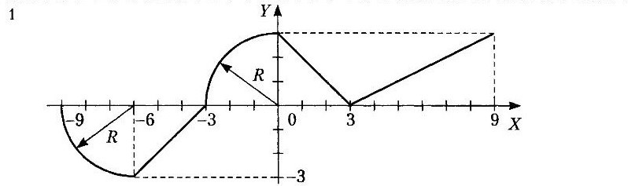

#Лабораторная работа 1.
##Теоретический материал: глава 4, раздел " Операторы ветвления".
###Вычисление значения функции
####Напишите программу,которая по введенному значению аргумента вычисляет значение функции, заданной в виде графика. Параметр R вводится с клавиатуры.

